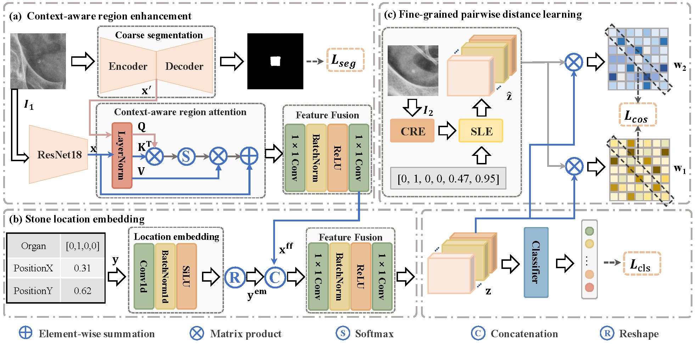
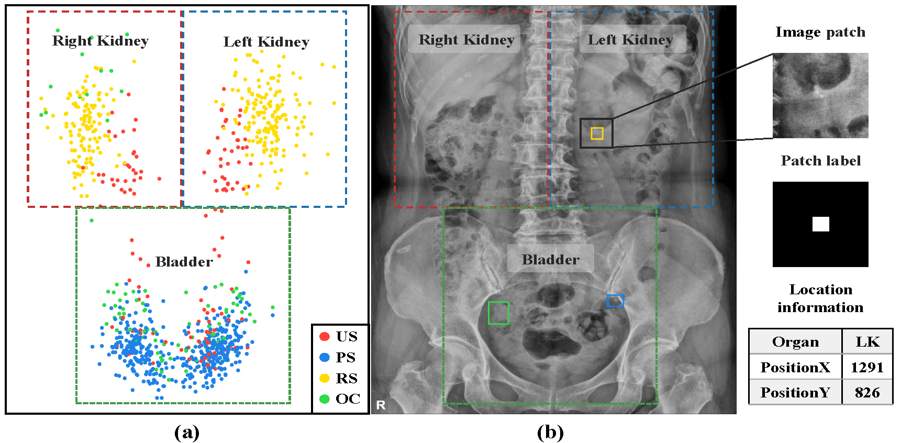
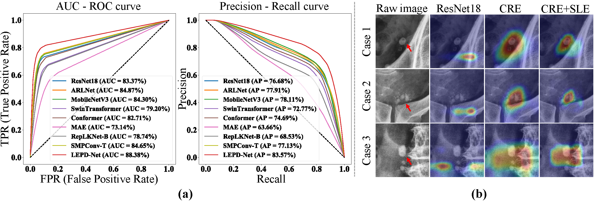

# LEPD-Net
**Location embedding based pairwise distance learning for fine-grained diagnosis of urinary stones** (https://arxiv.org/abs/2407.00431) published in MICCAI 2024

by [Qiangguo Jin](https://scholar.google.com/citations?user=USoKG48AAAAJ), Jiapeng Huang, [Changming Sun](https://vision-cdc.csiro.au/changming.sun/), et al.

### Example results 


- Figure 1: he overall architecture of LEPD-Net. (a) Context-aware region enhancement module. (b) Stone location embedding module. (c) Fine-grained pairwise distance learning module. It is noted that the fine-grained pairwise distance learning module will be removed during inference.
  

- Figure 2: (a) The stone location map. (b) Typical stone patch and the location information.
  

- Figure 3: (a) AUC-ROC, Precision-Recall curves and (b) Visual saliency maps of high-level features.

## Citation

If the code is helpful for your research, please consider citing:

  ```shell
@article{jin2024location,
  title={Location embedding based pairwise distance learning for fine-grained diagnosis of urinary stones},
  author={Jin, Qiangguo and Huang, Jiapeng and Sun, Changming and Cui, Hui and Xuan, Ping and Su, Ran and Wei, Leyi and Wu, Yu-Jie and Wu, Chia-An and Duh, Henry BL and others},
  journal={arXiv preprint arXiv:2407.00431},
  year={2024}
}

  ```

## Social media

<p align="center"></p> 
Welcome to follow our [Wechat official account: iBioMedInfo] and [Xiaohongshu official account: iBioMedInfo], we will share recent studies on biomedical image and bioinformation analysis there.

### Global Collaboration & Questions

**Global Collaboration:** We're on a mission to biomedical research, aiming for artificial intelligence and its applications to biomedical image and bioinformation analysis, promoting the development of the medical community. Collaborate with us to increase competitiveness.

**Questions:** General questions, please contact 'qgking@tju.edu.cn'


